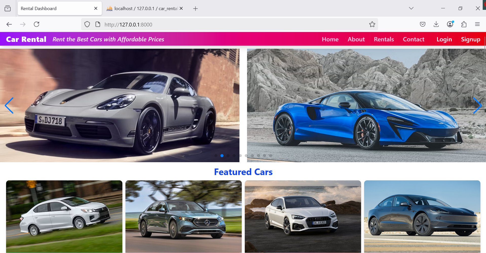
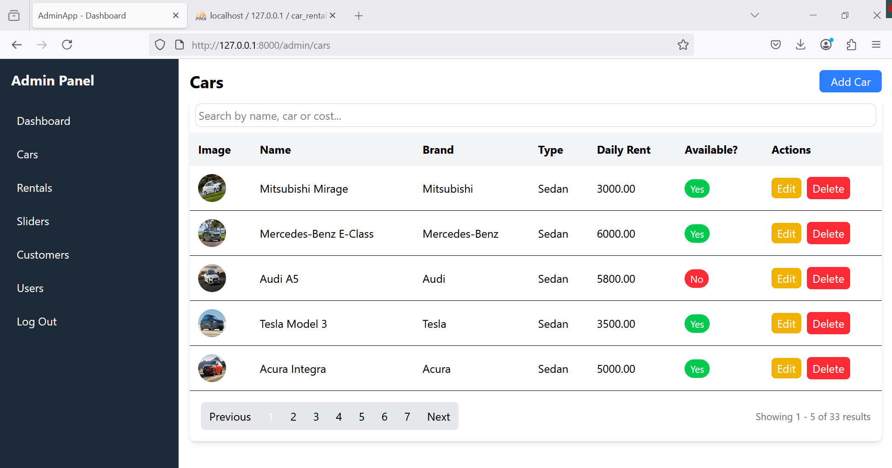

# 🚗 Car Rental Web Application

A modern Car Rental Management System built with **Laravel 12**, **Vue 3**, **Inertia.js**, and **Tailwind CSS**. The app features session-based authentication, role-based access control (Admin & Customer), rental booking, car availability tracking, and cost calculation.

📺 **Project Demo:** [Watch Video Demo](https://drive.google.com/file/d/1OzUoTm3oNJp1iyOvSEmb-W0ucA4Y2Fu0/view?usp=sharing)

---

## 🔧 Tech Stack

- **Backend**: Laravel 12
- **Frontend**: Vue 3 + Inertia.js
- **Styling**: Tailwind CSS
- **Database**: MySQL
- **Authentication**: Session-based (no Sanctum or Breeze)
- **Role Management**: Admin / Customer

---

## ✨ Features

- User signup & login system
- Role-based dashboard access
- Add, edit, delete cars (Admin)
- Book rentals with duration and total cost calculation
- Status update: Booked, Cancelled, Completed
- View rentals (Admin & Customer perspective)
- Dynamic search by car, customer, and cost
- Image upload for car listings
- Flash messages and error handling

---

## 🖼️ Screenshots

| Home (Customer) | Admin Panel |
|-----------------|-------------|
|  |  |

---

## 🚀 Getting Started

### Prerequisites

- PHP 8.x
- Composer
- Node.js & npm
- MySQL

### Installation

```bash
git clone https://github.com/engrshams/Car_Rental.git
cd car_rental
cp .env.example .env
composer install
php artisan key:generate
npm install && npm run dev
php artisan migrate --seed
php artisan serve
